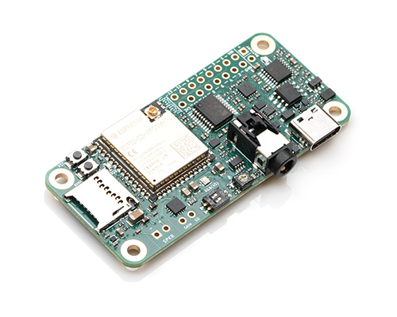

# Sonatino PCB Design Files

Sonatino is a powerful ESP32-S3-based audio development board that combines high-quality audio processing capabilities with wireless connectivity and extensive I/O options.

## Features

- ESP32-S3-WROOM-1U MCU with 16MB flash and 8MB PSRAM
- High-quality 24-bit/192kHz DAC (WM8524, stereo) and ADC (WM8782, mono)
- 3.2W speaker amplifier (MAX98357A)
- TRRS audio jack supporting input and output
- Stereo headphone amplifier and microphone preamp
- microSD card slot
- WiFi and Bluetooth 5.0 LE connectivity
- USB-C for programming and power
- Battery support with charging circuit
- Configurable audio I/O levels
- Compact form factor

## Component Availability

The ADC that Sonatino uses (Cirrus Logic WM8782) has been discontinued by its manufacturer. Some suppliers may still have limited stock, but ultimately it needs to be replaced with a similar ADC (possibly a Texas Instruments PCM186x chip or an audio CODEC to replace the ADC and DAC). In either case, the PCB schematic and layout will need to be modified as there is no drop-in replacement.

## Board Variants

### [Sonatino](https://github.com/luminationlabs/Sonatino) (`main` branch)

- Standard board documented at [sonatino.com](https://sonatino.com)
- Based on ESP32-S3-WROOM-1U
- Uses Bluetooth 5.0 LE **without** support for Bluetooth audio

### [Sonatino - Bluetooth Audio Edition](https://github.com/luminationlabs/Sonatino/tree/btaudio) (`btaudio` branch)

- Unreleased board
- Based on ESP32-WROOM-32UE
- Uses Bluetooth v4.2 BR/EDR and BLE **with** support for Bluetooth audio (A2DP)
- Has fewer exposed GPIO pins (10 vs 13)
- Requires configuration using shift register on GPIO 17, 18, and 19

## License and Trademark Notice

Certified open source hardware ([oshwa.org/cert](https://oshwa.org/cert)) - [OSHW] US002724

The design files for this PCB are open-source hardware under [CERN OHL-P v2.0](https://ohwr.org/cern_ohl_p_v2.txt).

The name "Sonatino" and the associated logo are trademarks of Lumination Labs, Inc. Other manufacturers may use the hardware design but may not use the "Sonatino" branding without permission.

The documentation for Sonatino is copyrighted by Lumination Labs, Inc. and provided for informational purposes only. Redistribution or modification of the documentation requires written permission.

## Documentation

For detailed documentation, examples, and a getting started guide, visit:

- [Documentation](https://sonatino.com/docs/)
- [Example Projects](https://github.com/luminationlabs/Sonatino-Examples)
